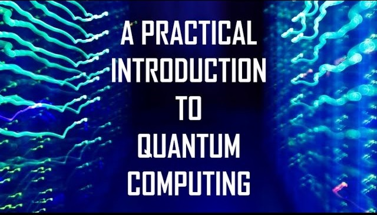

# Quantum-Computing-Course-CERN

Quantum computing is one the most promising new trends in information processing. In this course, we will introduce from scratch the basic concepts of the quantum circuit model (qubits, gates and measures) and use them to study some of the most important quantum algorithms and protocols, including those that can be implemented with a few qubits (BB84, quantum teleportation, superdense coding...) as well as those that require multi-qubit systems (Deutsch-Jozsa, Grover, Shor..).

We will also cover some of the most recent applications of quantum computing in the fields of optimization and simulation (with special emphasis on the use of quantum annealing, the quantum approximate optimization algorithm and the variational quantum eigensolver) and quantum machine learning (for instance, through the use of quantum support vector machines and quantum variational classifiers). We will also give examples of how these techniques can be used in chemistry simulations and high energy physics problems.

The focus of the course will be on the practical aspects of quantum computing and on the implementation of algorithms in quantum simulators and actual quantum computers (as the ones available on the IBM Quantum Experience and D-Wave Leap).

Individual links to all the materials needed for each lesson, including lesson recordings and practical exercises, can be found bellow:

- Lecture 1/7: [Introduction](https://indico.cern.ch/event/970903/)
What is quantum computing? Applications of quantum computing. Hardware and software for quantum computing. Elements of the quantum circuit model. Introduction to the IBM Quantum Experience

- Lecture 2/7: [One and two-qubit systems (Part 1)](https://indico.cern.ch/event/970904/)
What is quantum computing? Applications of quantum computing. Hardware and software for quantum computing. Elements of the quantum circuit model. Introduction to the IBM Quantum Experience

- Lecture 3/7: [One and two-qubit systems (Part 2)](https://indico.cern.ch/event/970905/)
Quantum teleportation. Superdense coding. Deutsch algorithm.   

- Lecture 4/7: [Multiqubit systems](https://indico.cern.ch/event/970906/)
Multiqubit gates and universality. Quantum parallelism. Deutsch-Jozsa algorithm. Grover algorithm. Shor algorithm. HHL algorithm.

- Lecture 5/7: [Quantum algorithms for combinatorial optimization](https://indico.cern.ch/event/970907/)
Quantum adiabatic computing and quantum annealing. Introduction to D-Wave Leap. Quantum Approximate Optimization Algorithm. 

- Lecture 6/7: [Quantum variational algorithms and quantum machine learning](https://indico.cern.ch/event/970908/)
Variational Quantum Eigensolver. Introduction to Quantum Machine Learning (QSVM, QGAN, Quantum Classifiers...)

- Lecture 7/7: [The future of quantum computing](https://indico.cern.ch/event/970909/)
Quantum error correction. What is Quantum Supremacy? Prospects for quantum computing. 
